# BUILDING A REAL-TIME SYSTEM HEALTH DASHBOARD WITH POWERSHELL, HTML, AND CSS USING WINDOWS VM

### Introduction

In today’s fast paced IT-world, ensuring system reliability is not merely an option - it is crucial for mission success. Downtime and unnoticed errors can cause the company or organisation a significant loss in time, money and reputation. The System Health Dashboard was developed to address these issues by providing a real-time, automated monitoring solution that collects crucial system metrics such as CPU usage, memory utilisation, disk health, uptime, network status and critical event logs. These metrics are displayed in an interactive HTML interface featuring a dark blue futuristic design. This dashboard offers immediate visual insights and will be very useful making swift decision makings, troubleshooting a problem or just observing performance trends. It operates seamlessly through  Windows Task Scheduler, ensuring that you get accurate and updated data. By emerging PowerShell scripting, HTML/CSS design and automation, I have not only demonstrated techincal skill but also the ability to create effective, real-world IT solutions that can simplify the work of system administrators.

### Tools & Technologies

- PowerShell (scripting & data collection)
- HTML & CSS (frontend presentation and styling)
- Windows Task Sheduler (automation)
- Visual Studio Code (code editor)
- Web Browser  (Chrome, Edge) for testing HTML

### System Requirements

- Windows 10/11
- PowerShell 5
- Chrome / Edge

### Step-by-Step implementation

1. **Planning the Dashboard**

Planning the dashboard took a bit of time and heavy reasoning. There are many system health metrics but my goal was to provide the key ones - CPU, memory, disk, uptime, network, and event logs. My focus was on real-time accuracy and easy readability. I gave the dashboard a futuristic dark blue theme to make the data visually appealing. I separated the Powershell script, HTML and CSS into different files to make the project maintainable. Lastly, I automated the script via Task Scheduler to ensure regular updates without manual intervention.

1. **Gathering System Data with PowerShell**

In Powershell, I was able to derive all the system metrics - these include the following:

- **HostName**: shows the name that identifies your computer in a local network

```powershell
$env:COMPUTERNAME
```

- **OSName:** shows what Operating System you are using

```powershell
$OSInformation = Get-CimInstance - ClassName Win32_OperatingSystem
$OSname = $OSInformation.Caption.Trim()
```

- **OSVersion:** shows the version of OS you are using

```powershell
(Get-CimInstance -ClassName Win32_OperatingSystem).Version
```

- **OSBuild number:** a specific identifier for the version of your OS

```powershell
(Get-CimInstance -ClassName Win32_OperatingSystem).BuildNumber
```

- **CPU Load Percentage:** shows you how much the CPU is currently in use

```powershell
(Get-CimInstance Win32_Processor).LoadPercentage
```

- **CPU Name(Model):** Identifies the exact CPU chip

```powershell
(Get-CimInstance Win32_Processor).Name
```

- **Number of Cores:** Finds the physical processing power of the computer

```powershell
(Get-CimInstance Win32_Processor).NumberOfCores
```

- **Number of Logical Processors:** Finds the multitasking capacity of the CPU

```powershell
(Get-CimInstance Win32_Processor).NumberOfLogicalProcessors
```

- **Total Physical Memory:** The total installed RAM on your system

```powershell
$totalMemory = (Get-CimInstance Win32_ComputerSystem).TotalPhysicalMemory/1GB
**I round this figure to give a concise result**
```

- **Available Memory:** Determines how many RAM is currently available (free space)

```powershell
$freeMemory = (Get-CimInstance Win32_OperatingSystem).FreePhysicalMemory/1MB
**I round this figure to give a concise result**
```

To dive deeper - check source code.

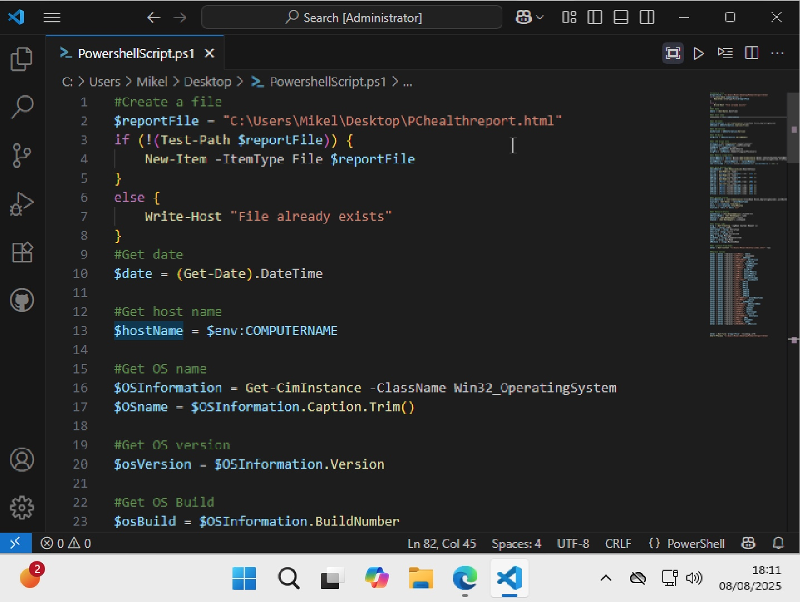

### Exporting Data to HTML

 In HTML, creatE placholders to accept the values from pwsh. Make sure to get the content of the html file in powershell by using this syntax:

```powershell
$html = Get-Content "C:\Users\Mikel\Desktop\index.html" -Raw
```

**Get-Content:** gets the data from the html file

**-Raw:** gets the content in the exact form, unedited, unmodified.

After getting the contents in HTML (the placeholders), assign the various system metrics data to each placeholder. After replacing the values, exporte the HTML file to the output file. 

Syntax:

```powershell
$html | Out-File "reportFile" -Encoding utf8
```

**reportFile:** is the output file, that renders script in a web browser.


### Styling with CSS

Create a separate CSS file and link it to the HTML file using this syntax:

```html
<link rel="stylesheet" href="style.css"
```

In the CSS file, style the page to your preference. I animated the background and gave it a dark-blue futuristic theme.

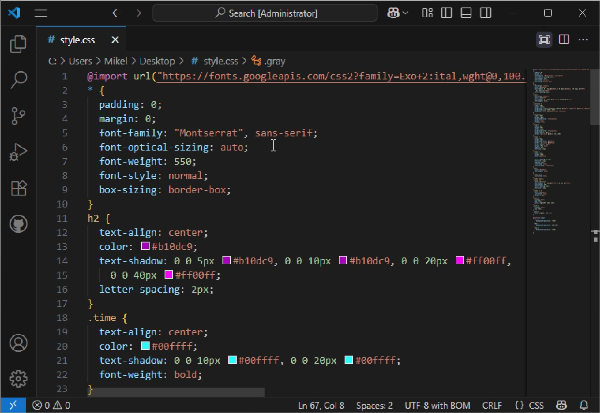

### Automation with Task Scheduler

- In the task scheduler, under the actions section in the top right panel. Choose **“Create Basic Task”**

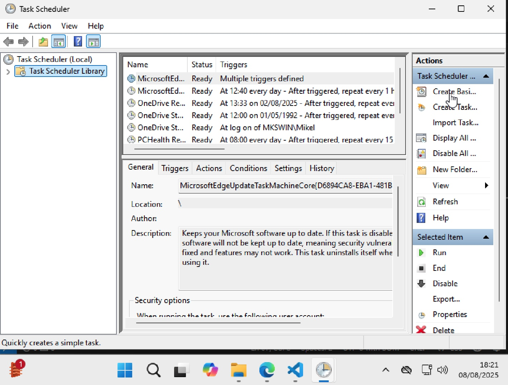

- In the “Create Basic Task” menu , give the script you want to automate a name.

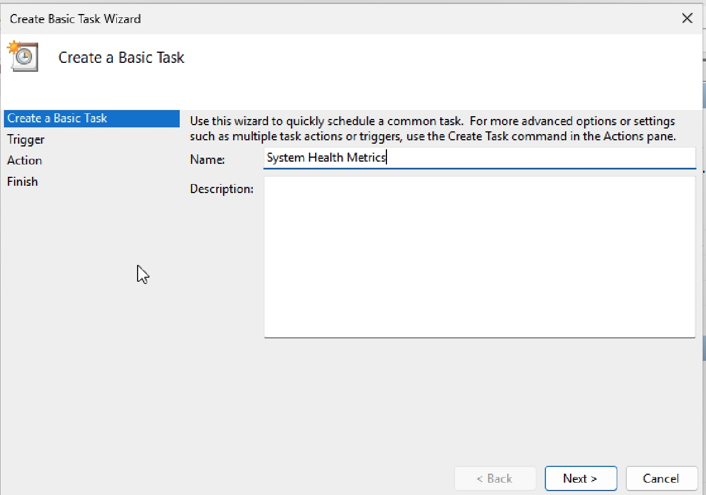

- Now in the “Trigger” menu, you will be asked when you want to start the automation. Choose daily to always get real-time and updated data. You will then be given the option set the time to when the automation should start.

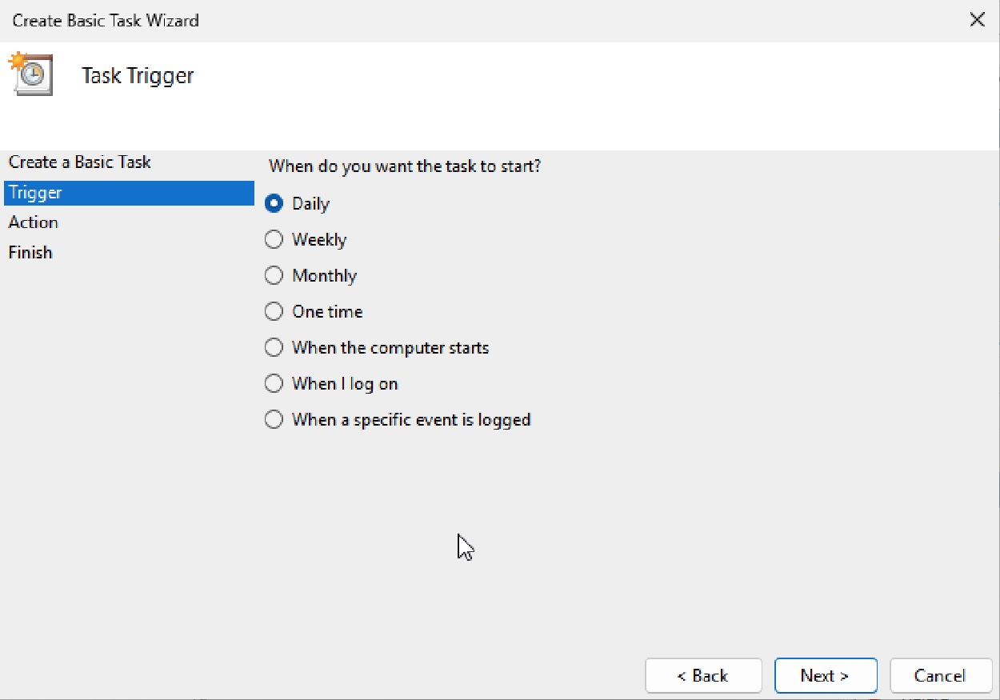

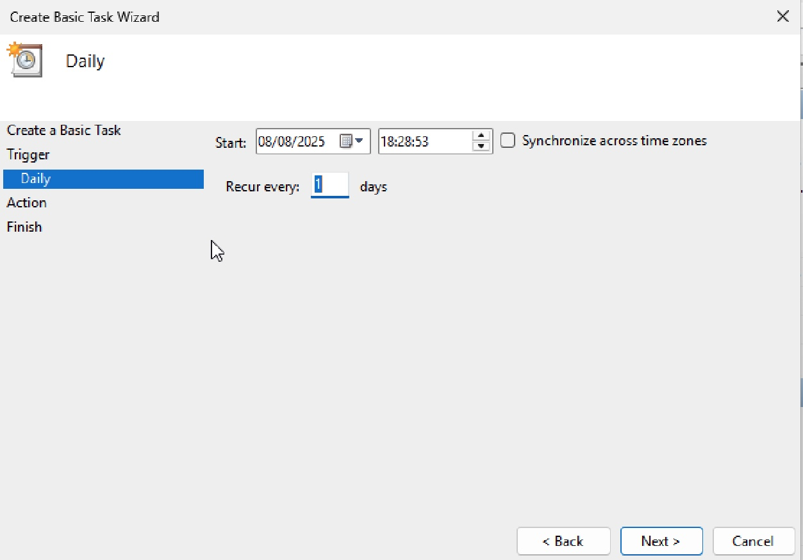

- The “Action” menu is what you want the task to do, choose “start a program” since we are dealing with a script here.

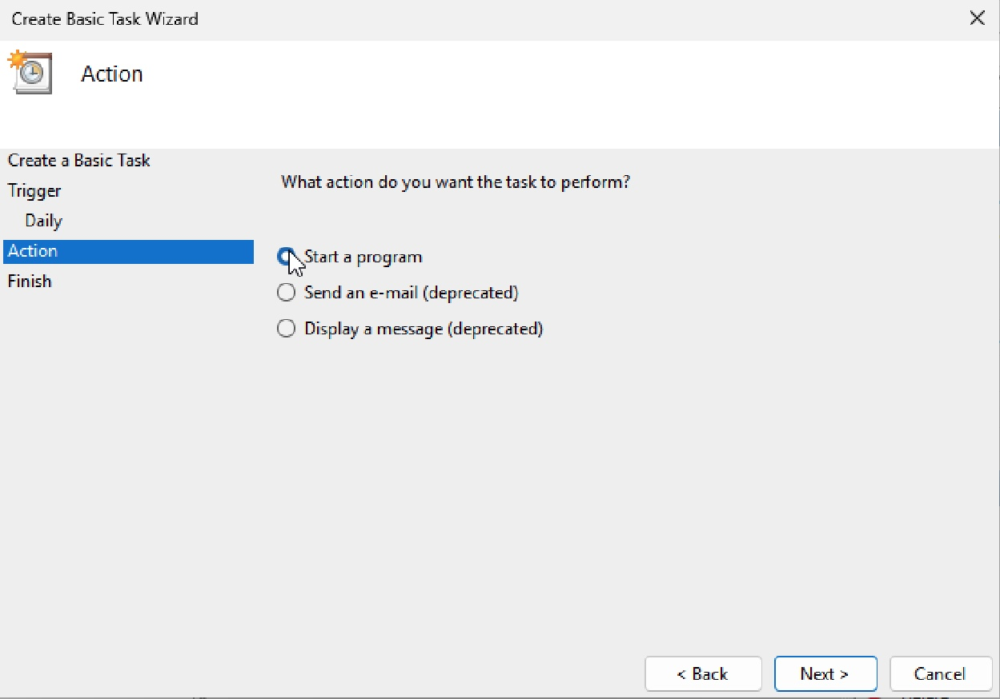

- In the “Start a Program” menu, enter powershell as the script you want to run. In the “Add arguments” text bar, write a script to bypass or ignore every restrictions to be able to run the script successfully.

Syntax:

```powershell
-ExcecutionPolicy Bypass -File "path to HTML file"
```

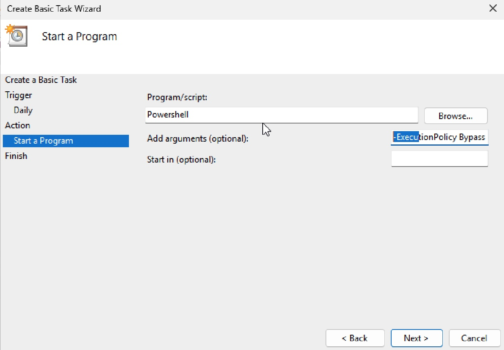

- The final part is the summary menu which shows you want you have done so far. Review your selections and click **“Finish”**

.jpeg)

In your task creation, you will not be given an option to set a time interval for the task to be repeated. So after creating the task, locate the file and navigate to the Trigger section on the top panel. In the Trigger menu, click on Edit. It will open a menu as shown in the image below:

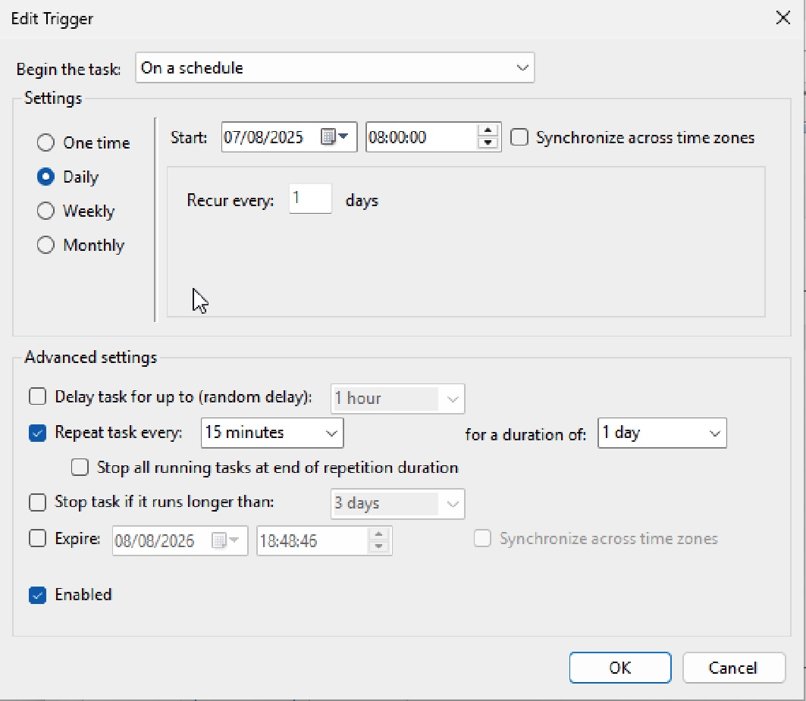

Check “Repeat task every” and set it 15mins. This means your script will run every 15 mins.

### Testing

Now to see if the task you created was successfully working, you will have to manually run the task. 

Locate your file and click “Run” in the actions panel on the right side.

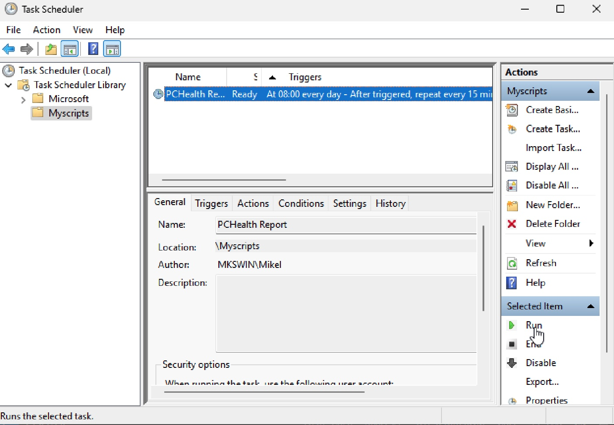


### FINAL RESULT

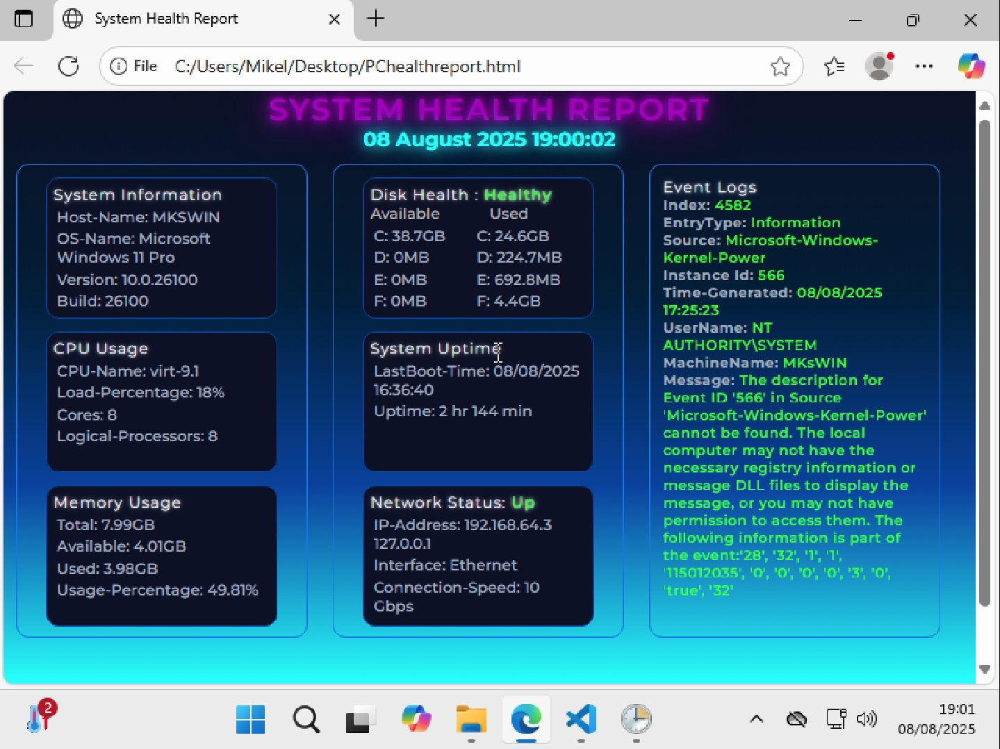
